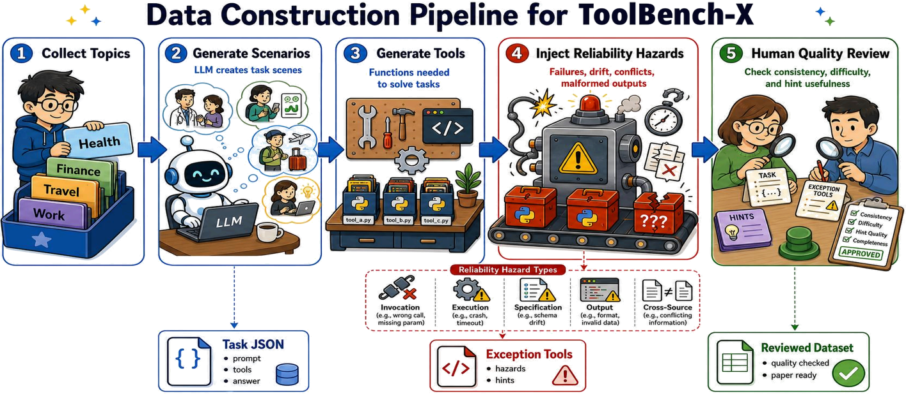

# ToolBench-X
<div align="center">

**Beyond Function Calling: Benchmarking Tool-Using Agents under Tool-Environment Unreliability**

<a href="https://arxiv.org/pdf/2606.25819">📄 Arxiv Paper</a> | <a href="https://huggingface.co/datasets/Foreverskyou/ToolBench-X">🤗 Huggingface</a>
</div>

**ToolBench-X** is the first benchmark for evaluating **tool-using agents under recoverable tool-environment unreliability**, which features executable multi-step tool-use tasks, structured reliability hazards, and automatic evaluation of hazard diagnosis and recovery capabilities.

## Project Structure

```
ToolBench-X/
├── agent/
│   ├── model_driven_core.py
│   ├── llm_client.py
│   ├── loader.py
│   ├── parser.py
│   ├── evaluation.py
│   └── utils.py
├── config/
│   ├── .env
│   └── settings.py
├── evalscope_adapter/
│   └── local_runtime.py
├── figures/
│   └── pipline.png
├── prompt_gentask.py
├── prompt_gentool.py
├── prompt_genexception.py
├── run_evalscope_local_runtime.py
├── gpt.py
├── gpt_gentask.py
├── gpt_gentool.py
├── gpt_genexception.py
├── run_test_time_scaling_from_clean.py
├── export_openai_trajectory_clean.py
├── topic.json
└── requirements.txt
```

## Quick Start

### Environment Setup

```bash
pip install -r requirements.txt
cp config/.env.example config/.env   # Edit .env with your API key
```

## Dataset

**License**:
```
ToolBench-X is only used for academic research. Commercial use in any form is prohibited.
Without prior approval, you cannot distribute, publish, copy, disseminate, or modify ToolBench-X in whole or in part. 
You must strictly comply with the above restrictions.
```

## Data Curation and Evaluation Pipeline

<p align="center">
    
</p>

📍 **Generate Tasks**

```bash
python3 gpt_gentask.py \
  --topics-file topic.json \
  --output-dir tasks \
  --max-workers 8
```

📍 **Generate Baseline Tools**

```bash
python3 gpt_gentool.py \
  --input-dir tasks \
  --output-dir tools_batch \
  --max-tasks 50 \
  --max-workers 8 \
  --reset
```

📍 **Inject Reliability Hazards + Generate Hints**

```bash
python3 gpt_genexception.py \
  --input-dir tasks \
  --tools-dir tools_batch \
  --output-dir tools_exception_batch \
  --baseline-results eval/baseline.json \
  --max-tasks 50 \
  --max-workers 8 \
  --reset
```

📍 **Evaluation**

```bash
python3 run_evalscope_local_runtime.py \
  --mode baseline \
  --tasks-dir tasks \
  --tools-dir tools \
  --model gpt-5.4 \
  --max-rounds 10 \
  --max-workers 8 \
  --output eval/baseline.json

# A/B evaluation (exception tools + deferred hints)
python3 run_evalscope_local_runtime.py \
  --mode ab \
  --tasks-dir tasks \
  --tools-dir tools_exception \
  --hint-catalog tools_exception/exception_hints_catalog.json \
  --hint-injection-mode deferred_on_first_error \
  --model gpt-5.4 \
  --max-rounds 10 \
  --max-workers 4 \
  --fail-seed 7 \
  --output eval/ab_deferred.json
```

> **Note**: `baseline` is not limited to clean tools. When pointed at `tools_exception/`, it is equivalent to no_hint (exception tools without hints). The `ab` mode runs no_hint and with_hint over the same exception tool directory for comparison.

## Further Analysis

### Export OpenAI-Format Trajectories

```bash
python3 export_openai_trajectory_clean.py \
  --input eval/results.json \
  --output-dir eval/openai_trajectory_clean/
```

### Test-Time Scaling

```bash
python3 run_test_time_scaling_from_clean.py \
  --input eval/openai_trajectory_clean/ab_deferred/gpt.json \
  --output eval/test_time_scaling/gpt.json \
  --model gpt-5.4 \
  --max-rounds 10 \
  --max-workers 8 \
  --fail-seed 7
```

## Citation

If you find our work helpful for your research, please consider citing our work.

```bibtex
@article{tian2026beyond,
  title={Beyond Function Calling: Benchmarking Tool-Using Agents under Tool-Environment Unreliability},
  author={Tian, Yang and Shi, Zhengpeng and Zhao, Bo},
  journal={arXiv preprint arXiv:2606.25819},
  year={2026}
}
```
